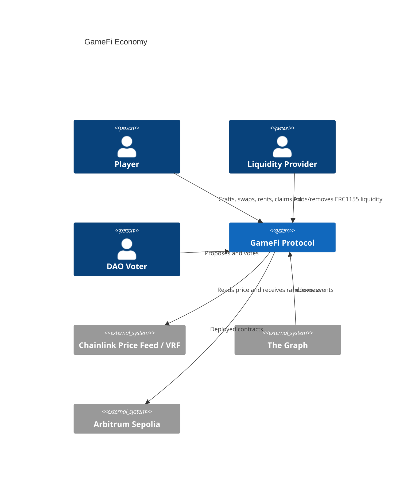
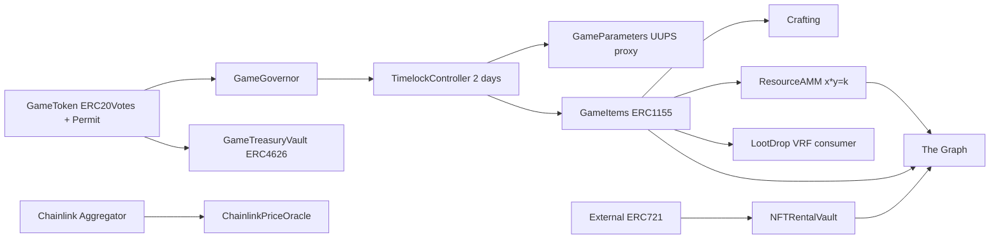
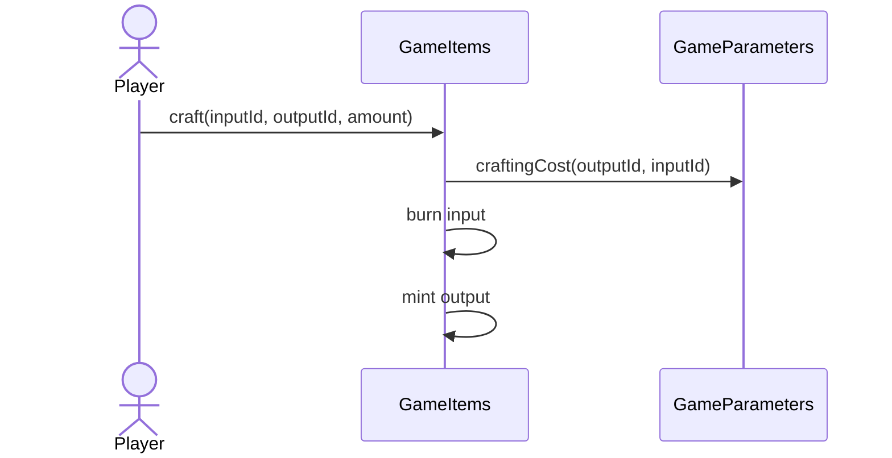
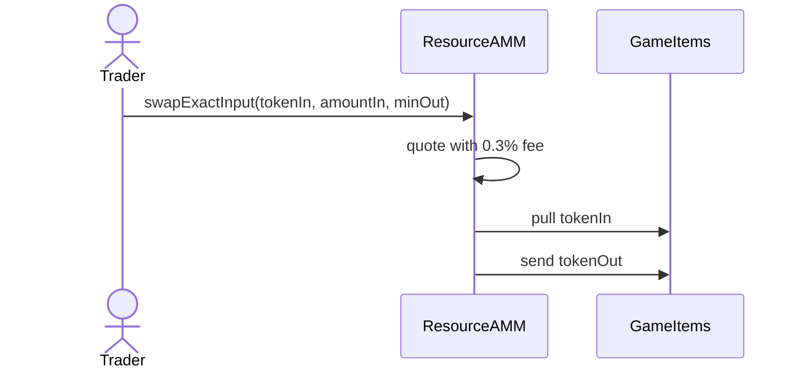
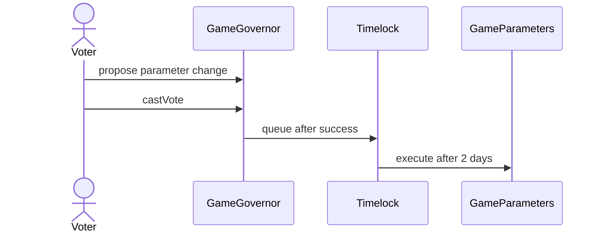

# GameFi Economy Architecture

## Scope

Option B implements an ERC-1155 in-game economy with crafting, a constant-product marketplace AMM for fungible resources, an NFT rental vault, Chainlink-style VRF loot drops, DAO-governed parameters, an ERC-4626 treasury vault, and L2 deployment scripts.

## C4 Context

## Components

## Critical Flows

### Craft

### Swap

### Propose, Vote, Execute

## Storage Layout

`GameParametersV1`: `_craftingCosts`, `dropRateBps`, `stalePriceWindow`.
`GameParametersV2`: appends `craftingFeeBps`. V2 only appends storage, so V1 slots are preserved and the UUPS implementation slot remains the ERC-1967 slot.

`ResourceAMM`: immutable `items`, `resourceA`, `resourceB`, `lpToken`; mutable `reserveA`, `reserveB`.

`NFTRentalVault`: `listings[key]` stores owner, renter, NFT address, token id, price, duration, expiry; `ownerBalances` stores pull payments.

## Design Patterns

Factory: `ResourceAMMFactory` deploys pools with CREATE and CREATE2.

UUPS proxy: `GameParametersV1` upgrades to `GameParametersV2`.

Checks-Effects-Interactions: withdrawals and rental claims update state before `call`.

Pull payments: rent proceeds are claimed by owners instead of pushed during rental.

Role-based access: ERC1155 minting, pausing, loot administration, and timelock governance are role gated.

Timelock: all privileged game parameter changes are expected to be routed through `TimelockController`.

Reentrancy guard: AMM swaps/liquidity, loot requests, and rental flows use `ReentrancyGuard`.

Oracle adapter: `ChainlinkPriceOracle` wraps AggregatorV3 and stale-price validation.

## Trust Assumptions

The Timelock is the long-term administrator. If the Timelock/governance token majority is compromised, attackers can change crafting costs, mint permissions, and treasury settings after the delay. The delay gives users time to exit. The deployer is removed from proposer/canceller roles in the deployment script.

## ADRs

ADR-001: Use ERC1155 for resources and crafted items. This keeps fungible resources and semi-fungible equipment in one token contract.

ADR-002: Use a resource-to-resource AMM instead of ERC20 pairs. This matches GameFi inventory flows and avoids wrapping every item id as an ERC20.

ADR-003: Use UUPS only for parameters. Upgradeability is isolated to values likely to evolve; asset contracts stay simpler.

ADR-004: Use pull rent payments. It avoids unexpected receiver behavior blocking rentals.

ADR-005: Use OpenZeppelin Governor. The rubric explicitly requires the OZ Governor stack, so bespoke governance was rejected.
